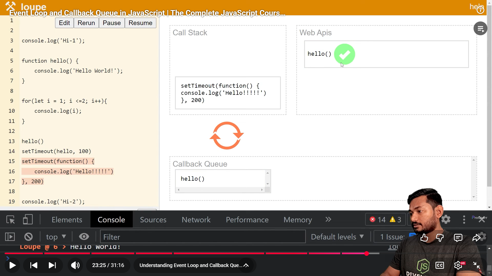

# 🔄 JavaScript Event Loop & Callback Queue (Detailed Beginner-Friendly README)

JavaScript is **single-threaded**, meaning it can run **only one line of code at a time**.  
So how does it handle things like delays, timeouts, clicks, or network calls without stopping the entire program?

The answer is:  
✔ **Event Loop**  
✔ **Web API**
✔ **Callback Queue**

Let’s understand these two clearly.

---

# 🧱 1. Call Stack (Where JS Runs Code)
Before understanding the event loop, you need the call stack.

- It stores and runs your functions.
- JavaScript executes code **line-by-line**.
- Only one function runs at a time.

Example:
```js
console.log("A");
console.log("B");
```

Both run immediately in the **call stack**.

---

# 🕒 2. setTimeout Does NOT Run Inside Call Stack
When you do:

```js
setTimeout(() => console.log("hello"), 2000);
```

JavaScript **does not** wait 2 seconds inside the call stack.

Instead:

1. `setTimeout()` is sent to the **browser timer system (Web API)**  
2. Browser counts 2 seconds **in the background**
3. After 2 seconds → callback (`console.log("hello")`) is moved to the **Callback Queue**

---

# 📥 3. Callback Queue (Waiting Area)
The **callback queue** is a list of functions waiting to run after the call stack becomes free.

Examples of callbacks that go here:
- `setTimeout`
- `setInterval`
- DOM event handlers (click, submit)
- I/O callbacks (Node.js)

Think of it as a **line of people waiting**.

---

# 🔁 4. Event Loop (The Bridge Between Queue & Stack)
The event loop constantly asks:

```
Is the call stack empty?
```

If **yes** → it takes one function from the **Callback Queue** and pushes it into the **Call Stack**.

If **no** → it waits.

### Meaning:
A setTimeout callback **will not run immediately after its time**,  
it will run **only when the call stack is free**.

---

# 🔍 5. Simple Example

```js
console.log("start");

setTimeout(() => {
    console.log("timeout");
}, 2000);

console.log("end");
```

### Actual Output:
```
start
end
timeout
```

### Why?
- `"start"` runs instantly
- `setTimeout` gives its callback to browser → browser starts 2s timer
- `"end"` runs instantly
- After 2 seconds → callback goes into **callback queue**
- Event loop waits until the stack is free
- Then `"timeout"` prints

---

# 🎯 Important Explanation
Even if the delay is `0 ms`:

```js
setTimeout(() => console.log("A"), 0);
console.log("B");
```

### Output:
```
B
A
```

Because:
- `setTimeout` callback → goes to Callback Queue
- `console.log("B")` → runs immediately
- Event loop brings callback only after call stack is empty

---

# 🧠 Final Summary

| Concept | What It Does |
|--------|--------------|
| **Call Stack** | Runs JS code (one thing at a time) |
| **Callback Queue** | Stores callbacks waiting to run (from timers, events) |
| **Event Loop** | Moves callbacks from queue → stack when stack is empty |
| **setTimeout** | Delay function → callback goes into callback queue after time |

### 🔑 Key Point:
**setTimeout never pauses the main thread.  
Its callback runs only when the call stack becomes empty.**

----

When a piece of code runs directly in the call stack, line by line, it is called synchronous code. This means JavaScript executes the code immediately without waiting for anything. But when a function does not run directly in the call stack — for example setTimeout, fetch, or event listeners — it first goes to the Web API, and after the task finishes, its callback is sent to the Callback Queue. From there, the Event Loop moves it back into the call stack when JavaScript is free. This type of code is called asynchronous code, because it does not block the main thread and runs later when the browser allows it.


----

# IN SIMPLE WORDS TO EXPLAIN IN THE INTERVIEW


# 🔄 JavaScript Event Loop & Callback Queue (Simple Explanation)

JavaScript is **single-threaded**, which means it can run **only one line of code at a time**.  
So, how does it handle tasks that take more time (like timers, network requests, or clicks) without stopping the entire program?

The answer is:

- **Event Loop**
- **Callback Queue**

---

## 🧩 Why Do We Need Event Loop & Callback Queue?
If a task takes long time, JavaScript does **not** wait for it in the main thread.

Instead:

1. Long-running tasks (ex: `setTimeout`, network calls) are sent **outside** the call stack.
2. Once they finish, their callbacks are placed in the **Callback Queue**.

---

## 📥 Callback Queue
The **Callback Queue** is a waiting line for functions that are ready to run but must wait until the call stack becomes empty.

Examples of tasks sent to the callback queue:
- `setTimeout`
- `setInterval`
- Event listeners (click, keypress)

---

## 🔁 Event Loop
The **Event Loop** is like a bridge between the **Call Stack** and the **Callback Queue**.

Its job:

```
Check if the call stack is empty:
    ✔ If empty → take the first function from the callback queue
                 and push it to the call stack
    ✘ If not empty → wait
```

This is why JavaScript can appear asynchronous even though it runs only one thing at a time.

---

## ⭐ Summary
- JavaScript runs code **one line at a time**.
- Long tasks go to Web APIs → then move to **Callback Queue**.
- **Event Loop** checks if the call stack is empty.
- If empty → Event loop moves the callback into the call stack.
- This mechanism makes async behavior possible in JS.

